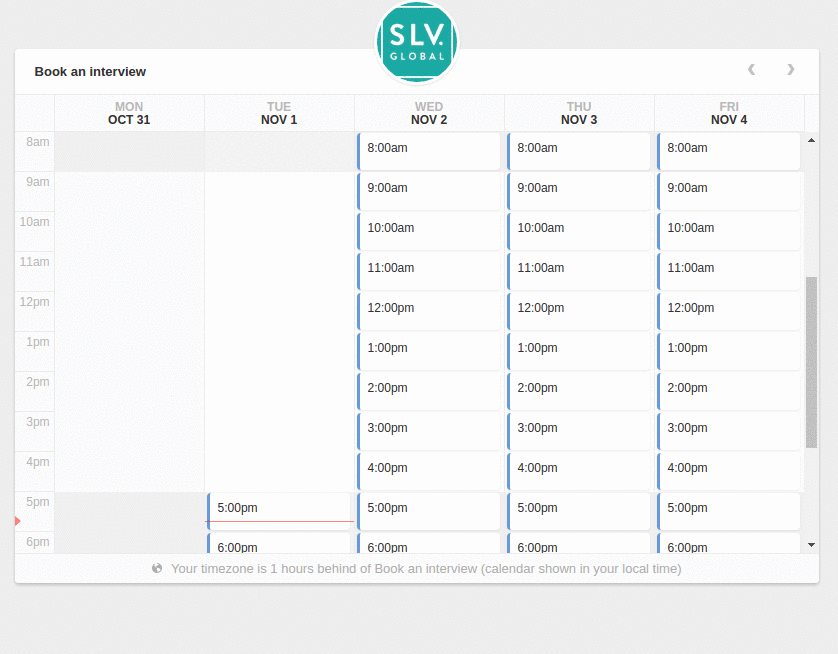

# fl-booking-js
A simple and beautiful appointment widget. An adaptation of [booking-js](https://github.com/timekit-io/booking-js).


Check the [demo](http://fourlabsldn.github.io/fl-booking-js/examples/bookings.html) out.



## How to use it

Include it in the page as an x-div controller, specifying auto-fill data and an API endpoint.


``` html
<x-div
  data-controller='../dist/fl-booking'
  data-api="http://localhost:8080"
  data-autofill-user="James"
  data-autofill-email="james.brown@soul.com"
/>
```

The endpoint will be queried in the following routes:
**POST: `/findtime`**
Answer should look like this:

``` javascript
{
  "data" : [{
      "start": "2016-11-01T18:00:00.000Z",
      "end": "2016-11-01T19:00:00.000Z"
    }, {
      "start": "2016-11-01T19:00:00.000Z",
      "end": "2016-11-01T20:00:00.000Z"
    }, {
      "start": "2016-11-01T20:00:00.000Z",
      "end": "2016-11-01T21:00:00.000Z"
    }, {
      "start": "2016-11-01T21:00:00.000Z",
      "end": "2016-11-01T22:00:00.000Z"
    }]
}

```


**GET: `/users/timezone/?email=myemail@host.com`**
Answer should look like this:

``` javascript
{
  data: {
    timezone: 'Europe/Stockholm',
    utc_offset: 1,
  },
}
```

## Configuration

For more configuration options give a look at the [defaultConfig](./src/defaultConfig.js) file.

## Dependencies

fl-booking-js depends on x-div which is a Web Component. Check the [browser support](http://caniuse.com/#search=Custom%20Elements)
if you are taking it to production. You may need to use a [polyfill](http://webcomponents.org/polyfills/).

## Installation
**NPM**

```bash
npm install fl-booking-js --save
```

**Download**

Just copy [fl-booking-js](https://github.com/fourlabsldn/fl-booking-js/blob/master/dist/fl-booking.min.js) file, and [its dependency x-div](https://raw.githubusercontent.com/fourlabsldn/x-div/master/js/x-div.js). Done.
